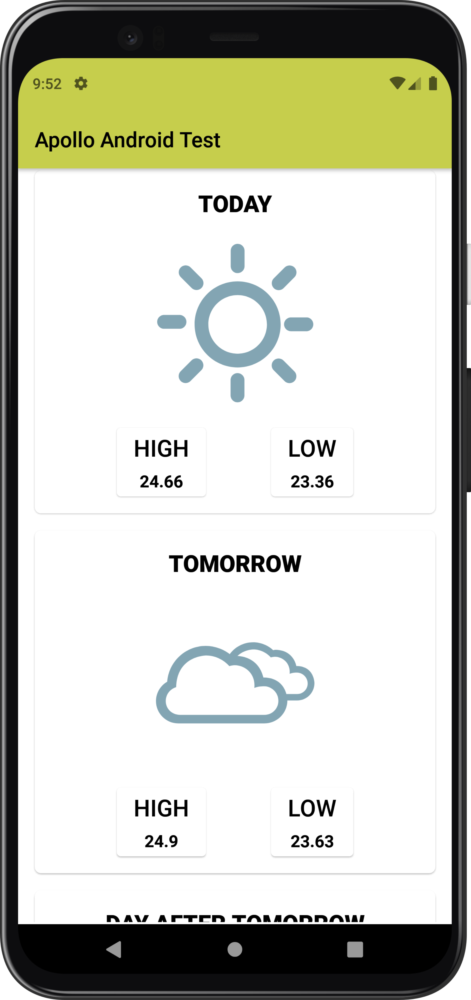
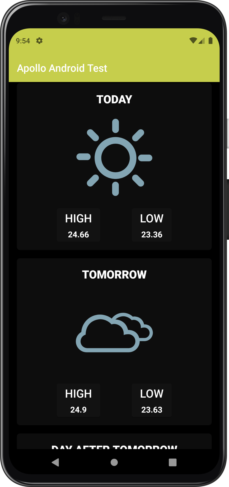

Apollo Agriculture Android Take Home Assignment
==============

Requirements
----

- Add a second screen to the app with weather data for the current location. Use the following
  initial wireframe we've made:
  

- The output from our weather API looks like this:

 ```json
{
  "today": {
    "lowTemp": 23.36,
    "highTemp": 24.66,
    "icon": "CLEAR_DAY",
    "description": "clear sky"
  },
  "tomorrow": {
    "lowTemp": 23.63,
    "highTemp": 24.9,
    "icon": "SCATTERED_CLOUDS_DAY",
    "description": "scattered clouds"
  },
  "dayAfterTomorrow": {
    "lowTemp": 22.73,
    "highTemp": 25.14,
    "icon": "BROKEN_OVERCAST_CLOUDS_DAY",
    "description": "broken clouds"
  }
}
 ```

Feel free to use however you think best in the app, it's also available
at [https://apollo-web-public.s3.eu-west-1.amazonaws.com/eng/android-takehomeassignment/weather.json](https://s3.eu-west-1.amazonaws.com/assets.apolloagriculture.com/recruitment/android/weather.json)
so feel free to add an API client.

- Documentation for the API is available in `API.md` in this folder.
- Use any libraries for Android that you want, but we will need to be able to build your code to
  evaluate it.

## Architecture

## Layers

### 1. Domain

This is the core layer of the application. The ```domain``` layer is independent of any other layers
thus the domain models and business logic can be independent from other layers.This means that
changes in other layers will have no effect on domain layer eg. screen UI (presentation layer) or
changing database (data layer) will not result in any code change withing domain layer.

Components of domain layer include:

- __Models__: Defines the core structure of the data that will be used within the application.

- __Repositories__: Interfaces used by the use cases. Implemented in the data layer.

### 2. Data

The ```data``` layer is responsible for selecting the proper data source for the domain layer. It
contains the implementations of the repositories declared in the domain layer.

Components of data layer include:

- __Models__

  -__Dto Models__: Defines POJO of network responses.

- __Repositories__: Responsible for exposing data to the domain layer.

- __Mappers__: They perform data transformation between ```domain```, ```dto``` and ```entity```
  models.

- __Network__: This is responsible for performing network operations eg. defining API endpoints
  using [Ktor](https://github.com/ktorio/ktor).

- __Cache__: This is responsible for performing caching operations
  using [Room](https://developer.android.com/topic/libraries/architecture/room).

- __Data Source__:  Responsible for deciding which data source (network or cache) will be used when
  fetching data.

### 3. Presentation

The `presentation` layer contains UI components.

# Tech Stack

This project uses many of the popular libraries, plugins and tools of the android ecosystem.

## Libraries

- [Koin](https://github.com/google/hilt) - Dependency Injection library.
- [Jetpack Compose](https://developer.android.com/jetpack/compose?gclid=Cj0KCQiA95aRBhCsARIsAC2xvfwC4pw6JG3r8U_4zVVSzwfCSIMMM8MKPMGAOTRoMjpkfpimPVz1FwoaAqlUEALw_wcB&gclsrc=aw.ds)
    - Modern toolkit for building native UI.
- [Ktor](https://ktor.io/docs/getting-started-ktor-client.html) - Provides multiplatform libraries
  required to make network calls to the REST API.
- [kotlinx.serialization](https://github.com/Kotlin/kotlinx.serialization) - Provides sets of
  libraries for various serialization formats eg. JSON, protocol buffers, CBOR etc.
- [Coroutines](https://github.com/Kotlin/kotlinx.coroutines) - Library Support for coroutines.
- [ViewModel](https://developer.android.com/topic/libraries/architecture/viewmodel) - Designed to
  store and manage UI-related data in a lifecycle conscious way. The ViewModel class allows data to
  survive configuration changes such as screen rotations.
- [Navigation Component](https://developer.android.com/guide/navigation/navigation-getting-started)Component
  that allows easier implementation of navigation from simple button clicks to more complex
  patterns.
- [Timber](https://github.com/JakeWharton/timber) - Library for easier logging.
- [Material Design](https://material.io/develop/android/docs/getting-started/) - Build awesome
  beautiful UIs.
- [SplashScreen API](https://developer.android.com/guide/topics/ui/splash-screen) - Loading
  application splashscreen.
- [Firebase Analytics](https://firebase.google.com/products/analytics) - A real time analytics
  tracking tool.
- [Firebase Crashlytics](https://firebase.google.com/products/crashlytics) - A real time crash
  reporting tool.
- [Firebase App Distribution](https://firebase.google.com/products/app-distribution) - Distribute
  debug app to testers/QA before release.

## Test Libraries

- [Junit4](https://developer.android.com/training/testing/instrumented-tests/androidx-test-libraries/rules)
    - Test framework which uses annotations to identify methods that specify a test.
- [Robolectric](http://robolectric.org/) - Framework used to quickly and reliably run unit tests
  quick using the JVM.
- [Espresso](https://developer.android.com/training/testing/espresso)
- [Truth](https://truth.dev/) - Assertions Library,provides readability as far as assertions are
  concerned.
- [Mockk](https://site.mockito.org/) - Mocking framework for tests.
- [Ktor Client Mock](https://ktor.io/docs/http-client-testing.html#add_dependencies) - Simulates
  HTTP calls for unit and integration tests without connecting to the endpoint.

## Gradle Plugins

- [KtLint](https://github.com/JLLeitschuh/ktlint-gradle) - Creates convenient tasks in your gradle
  project that run kotlin lint checks or do code auto format.
- [Detekt](https://github.com/detekt/detekt)- A static code analysis tool for the Kotlin programming
  language.

## CI/CD

- [GitHub Actions](https://github.com/VictorKabata/android-agri/actions) - GitHub actions is used in this
  project to check for syntax correctness using linting, execute the unit tests, generate a new
  package and deploying the debug apk
  using [Firebase App Distribution](https://firebase.google.com/docs/app-distribution) when pushing
  changes to the dev branch or when making a pull request to the main branch.

# Screenshots

These are the app's screenshots:

 
